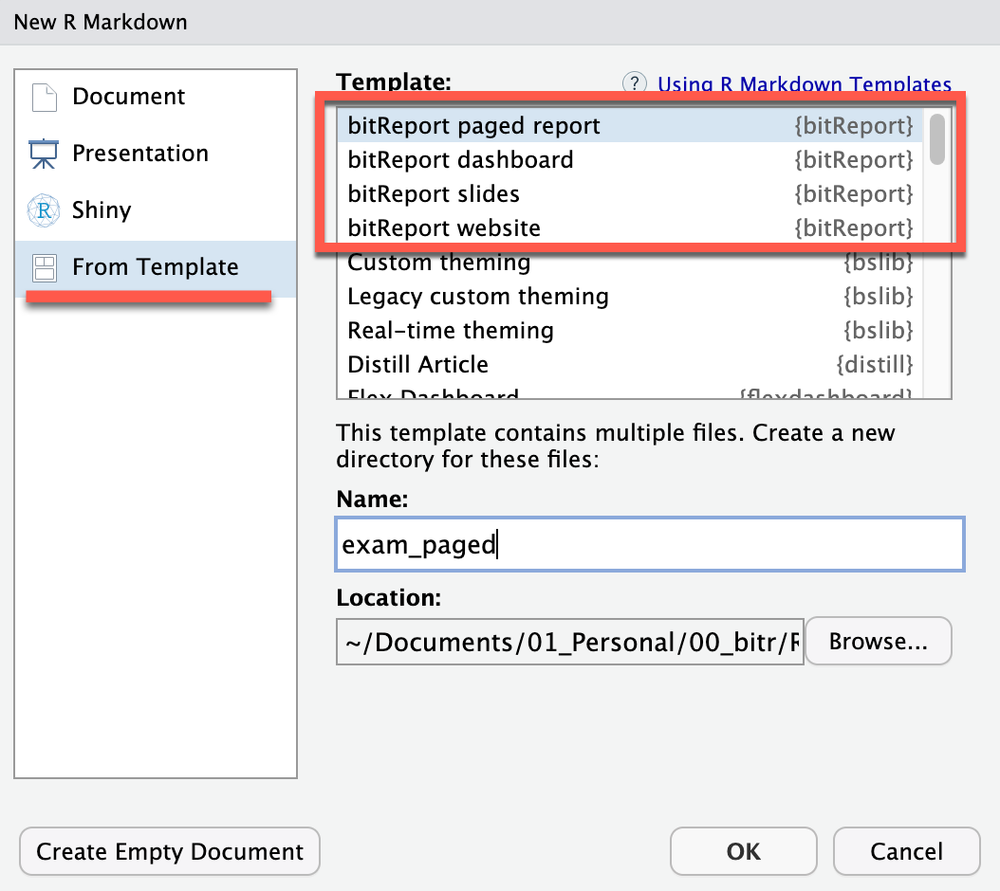
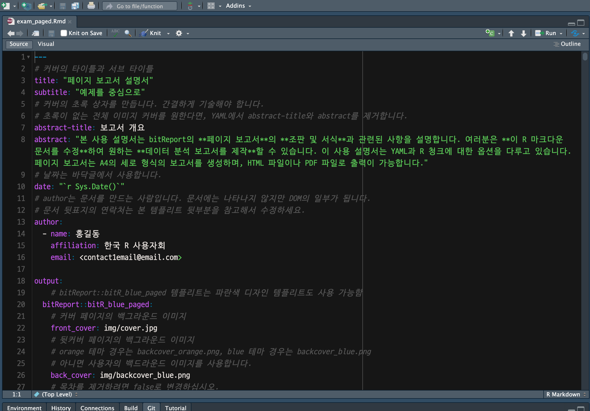
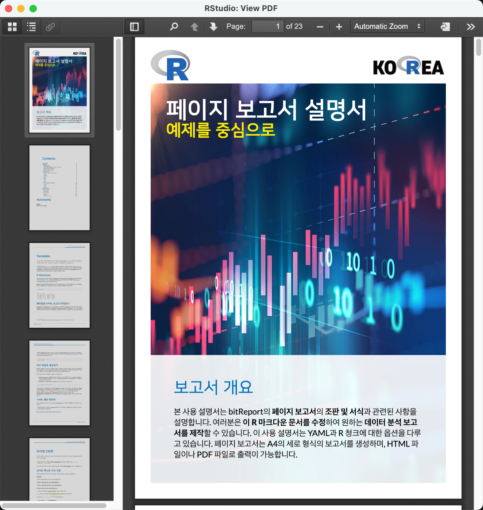
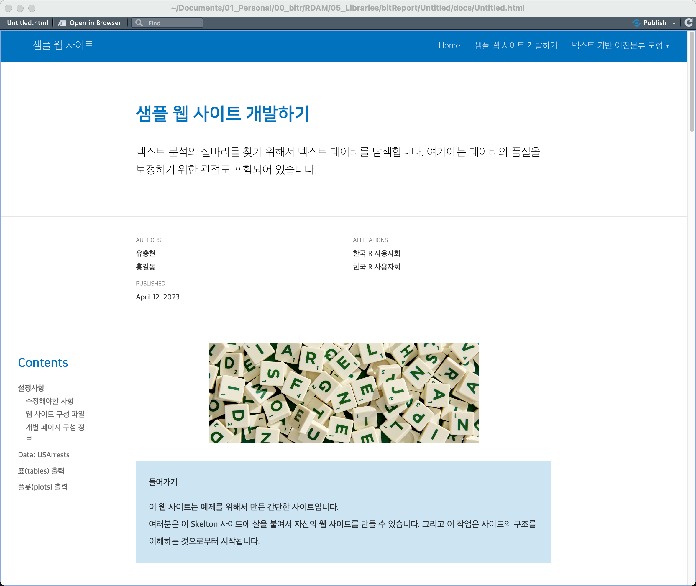
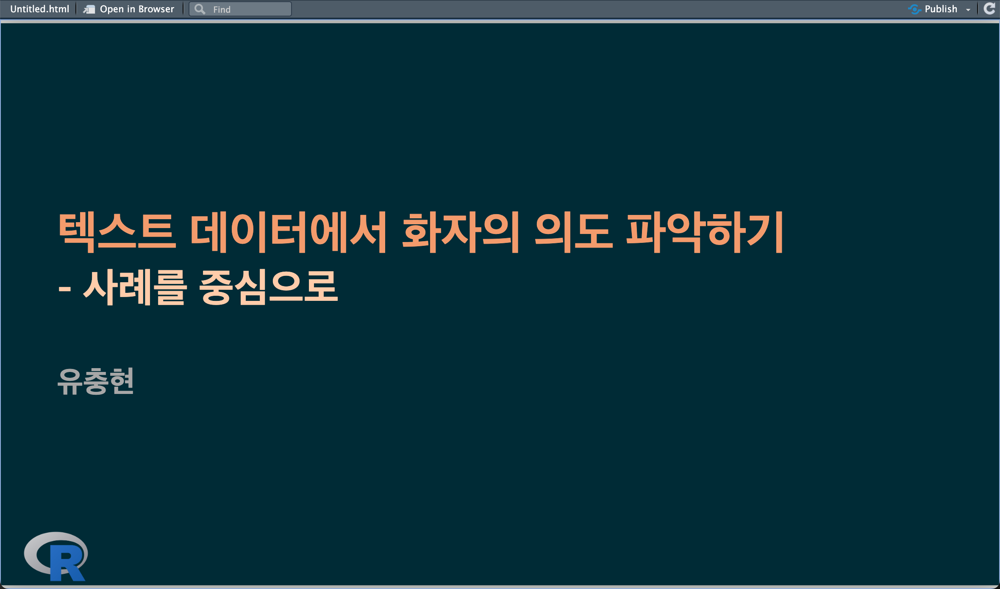
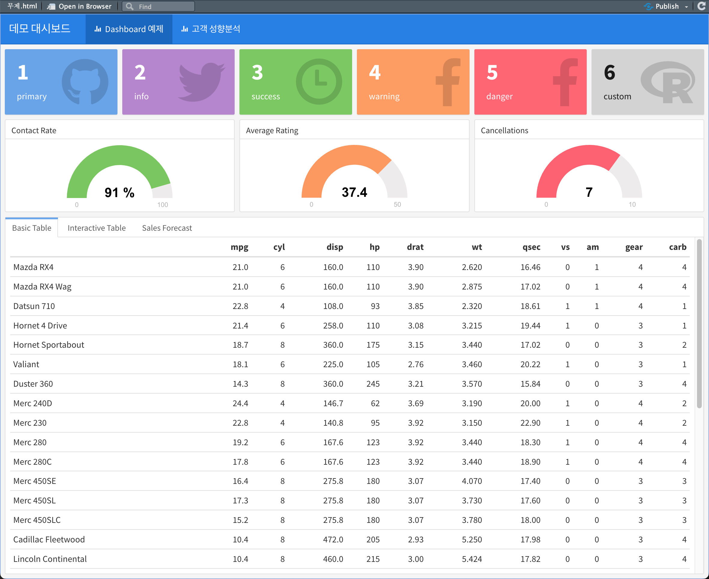

---
output:
  github_document
---

<!-- README.md is generated from README.Rmd. Please edit that file -->

```{r, echo = FALSE, message=FALSE}
knitr::opts_chunk$set(
  tidy.opts = list(width.cutoff = 70), tidy = TRUE,
  collapse = TRUE,
  comment = "#>",
  fig.path = "man/figures/README-"
)

library(bitReport)
```

# bitReport 

## Overview

공유 목적으로 배포할 데이터분석 **보고서의 핵심은 인사이트의 제공**에 있습니다. **그러나** 인사이트 발굴을 위한 분석가의 노력과 더불어 보고서 서식을 만들고, 시각화 결과를 옮겨서 **문서를 편집하는 일련의 작업들에도 많은 리소스가 소비**됩니다. 이와 같은 **휴먼 리소스의 소비를 줄이고자 보고서 (반)자동화 방법을 제시**합니다.

### 무엇이 문제인가?

- Markdown이라는 훌륭한 조판/저작 도구가 있으나 활용하지 않는다.
    - 파워포인트 편집 중심
    - 분석 결과는 파워포인트로 탄생하지만,
        - 과정에서의 정보는 개인의 암묵적 지식으로 남고,
        - 개인과 조직의 자산으로 남지 않는다.
- 재현성의 부재
    - Reproducible Research 기반의 저작이 이루어지지 않음
        - 파워포인트로의 편집시에 코딩 오류가 발생할 수 있음
        - 버전관리 이슈로 보고서의 결과가 관리되는 스크립트의 결과가 아닌 엉뚱한 결과로 배포될 수 있음
- 노동 집약적인 서식작업/편집작업
    - 결과를 복사하거나, 플롯을 복사해서 파워포인트에 붙여넣음
        - 수작업의 자동화로 분석 결과의 코딩오류를 줄이고,
        - 단순 작업을 자동화로 대체하여 리소스를 절약할 필요가 있음

## bitReport 기능과 특징

### 기능

- 정적 리포트 작성
    - 세로방향 PDF 페이지 문서 생성
    - 웹 페이지 생성  
- 동적 리포트 작성
    - 웹 대시보드 생성
    - 웹 슬라이드 문서 생성

### 특징

- 보고서 템플리트 제공
    - RStudio의 메뉴로 제공
    - 템플리트를 수정해서 보고서 생성
- 시각화 및 도표 출력 템플리트 함수 제공
    - 템플리트 함수를 이용하거나 수정해서 보고서에 삽입할 도표나 플롯 출력
- 한글 폰트 포함
    - NanumSquare 폰트
- 웹 페이지를 스크린샷 할수 있는 프로그램 포함
    - webshot 패키지를 이용한 스크린 샷


## 사용방법

### 정적 리포트 작성

#### 세로방향 PDF 페이지 문서 생성

RStudio에서 `File` > `New File` > `R markdown...` 메뉴를 선택하면 다음처럼 bitReport 패키지의 Template를 선택할 수 있는 다이얼로그가 출력됩니다.

{width=45% height=60%}

`bitReport paged report`를 선택한 후 리포트 이름을 입력합니다. 여기서는 `exam_paged`라는 이름을 지정했습니다.
`OK` 버튼을 누르면 다음처럼 스크립트 창에 템플리트가 생성됩니다.

{width=60%}

템플리트는 그 내용이 정적 리포트를 생성하는 Rmarkdown의 청크 관련 학습서입니다.

`Knit` 아이콘을 눌러 보고서를 생성합니다. 

{width=60%}


#### 웹 페이지 생성

정적 리포트 작성과 같은 방법으로 웹 페이지를 생성합니다. 하나의 독립적인 웹 사이트가 구축됩니다.

생성된 예제 웹 사이트는 다음과 같습니다.

{width=60%}


###  동적 리포트 작성

#### 슬라이드 생성

정적 리포트 작성과 같은 방법으로 프리젠테이션을 위한 슬라이드를 생성합니다. 

생성된 예제 슬라이드는 다음과 같습니다.

{width=60%}


#### 대시보드 생성

정적 리포트 작성과 같은 방법으로 대시보드를 생성합니다. 

대시보드도 일종의 웹 사이트로, 생성된 예제 대시보드는 다음과 같습니다.

{width=60%}


