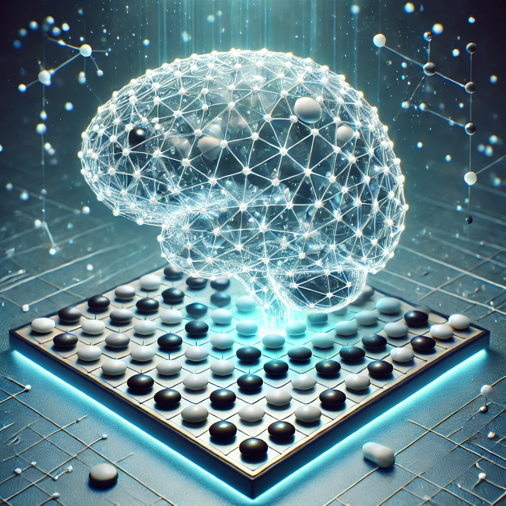
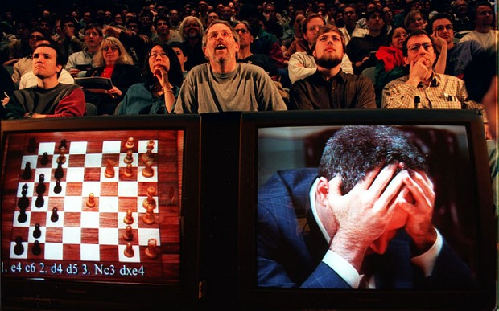
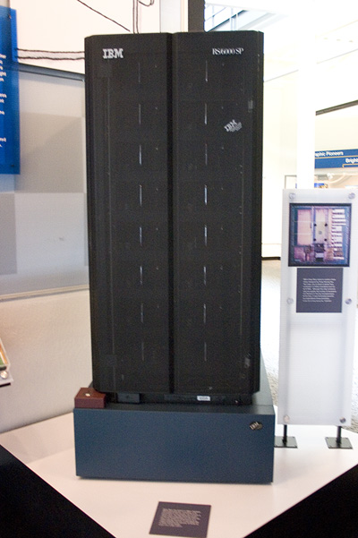
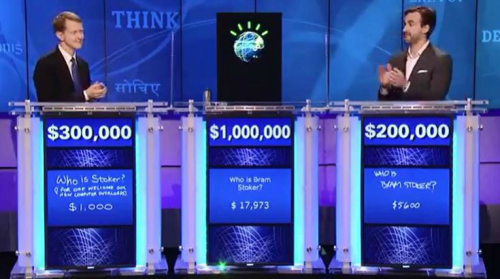
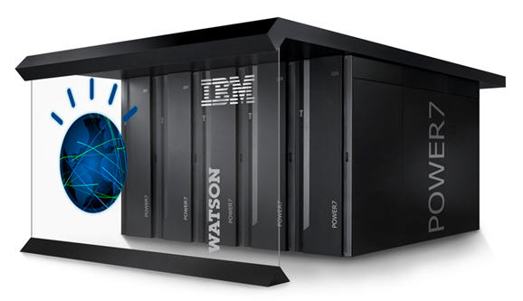
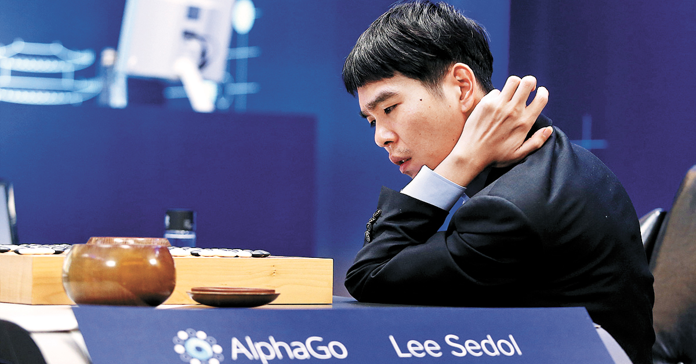
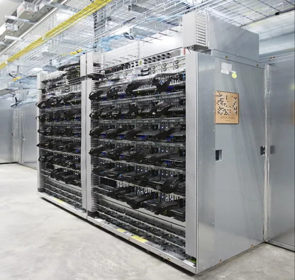
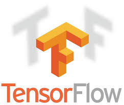

```{r setup, include=FALSE}
knitr::opts_chunk$set(echo = TRUE,
                      fig.retina = 2,
                      fig.showtext = TRUE,
                      dev = "ragg_png",
                      dpi = 300)

library(tidyverse)
```

```{r create-reportno, echo=FALSE, message=FALSE, warning=FALSE}
str_css <- ""

##==============================================================================
## 좌측상단 로고 이미지 설정 정의
##==============================================================================
## 첫 페이지 좌측 상단의 로고 이미지를 지정합니다.
## 지정하지 않으면, 한국R사용자회 로고를 출력합니다.
logo_img <- NULL
ruler_color <- "blue" # "violet", "green", "blue", "orange"

if (!is.null(logo_img)) {
  base64_logo <- knitr::image_uri(logo_img)
  
  ruler_file <- file.path(system.file(package = "bitReport"), "resources", "image", 
                          glue::glue("header-ruler-left-{ruler_color}.svg"))
  base64_ruler <- knitr::image_uri(ruler_file)
  
  str_css <- paste0(str_css,
    ".pagedjs_page.pagedjs_first_page {
        background-image: url('", base64_logo, "'), url('", base64_ruler, "') !important;
        background-repeat: no-repeat, no-repeat;
        background-position: 13mm 3mm, 15mm 28mm;
        background-size: 50mm, 180mm;
    }
    
    ")
}

##==============================================================================
## Report NO 정의
##==============================================================================
str_css <- paste0(str_css, 
".pagedjs_page.pagedjs_first_page .pagedjs_margin-top-left>.pagedjs_margin-content::after {
    content: 'bit Report, Report No: ", params$reportno, "' !important;
}")

bitReport::str2css(str_css)
```

## 들어가기 {-}

:::{.bg-theme}
2016년 3월에 인공지능로봇 알파고(Alpha Go)와 프로 바둑기사인 이세돌 9단과의 **역사적인 인간과 인공지능의 대결**이 펼쳐졌었고 알파고의 일방적인 승리라고 할 수 있는 4대1의 압승으로 끝났습니다. 이 것은 대중들이 **인공지능(AI)에 대해 새롭게 인식**하게 된 결정적인 사건으로 자리매김하게 됩니다.
:::

<br>

:::: {style="display:grid; grid-template-columns: 20% 80%; grid-row-gap: 15px; align-self:start"}
::: {style="margin-top: 0px; margin-bottom: 0px;"}

```{r, echo=FALSE, out.width = "80%"}

```

:::

::: {style="color:grey; margin-top: 5px;"}

"속도 조절이라는 게 사실 중요해요. 준비가 안돼 있을 땐 어떤 파국이 발생할지 모르거든요. 기술이 너무 앞서 나가지 않도록 충분히 준비만 한다면 기술이 부정적인 방향으로 발전할 일은 없을 것이라고 생각합니다." <br>&nbsp;&nbsp;&nbsp;&nbsp;-- 이세돌 (2016년 3월 알파고와 대국 후)

:::
::::

<br>

> 인공지능과 인간의 대결은 알파고 이전에도 있었습니다. 역사적인 대결을 통해 인공지능의 발전과 인간의 인식이 어떻게 변화했는지 살펴보겠습니다.
>
> 디플래닉스 편집자

<br>

## 인공지능과 인간의 대결 사례 {-}

```{r, echo=FALSE}
data.frame(
  year = c("1997", "2011", "2016"),
  title = c("딥 블루 vs. 개리 카스파로프", "왓슨의 제퍼디 챌린지 우승",
            "알파고 vs. 이세돌"),
  desc = c("IBM의 딥 블루가 체스 세계 챔피언 개리 카스파로프를 이기며 AI의 잠재력을 증명",
           "IBM의 왓슨이 퀴즈 쇼 '제퍼디'에서 인간 우승자를 이기며 자연어 처리 능력을 입증",
           "구글의 알파고가 바둑 세계 챔피언 이세돌을 이기며 AI의 복잡한 전략적 사고 능력을 증명")
) |> 
  select(`년도` = year, `이벤트` = title, 
         `내용` = desc) |> 
knitr::kable(table.attr = "class=\"table table-striped-theme\"",
             format.args = list(big.mark = ','),
             format = "html",
             caption = "인공지능과 인간의 대결") 
```


:::{.page-break}
:::


## 1997년: 딥 블루 vs. 개리 카스파로프 {-}

### 사건 개요

IBM의 슈퍼컴퓨터 **[딥 블루(Deep Blue)가 체스 세계 챔피언 개리 카스파로프(Garry Kasparov)를 이겼습니다]{.blue}**. 이는 **[AI가 복잡한 전략 게임에서 인간을 능가할 수 있음을 보여준 사건]{.orange}**입니다.

카스파로프는 1986년부터 은퇴하던 2005년까지 줄곧 세계 랭킹 1위를 고수한 체스의 전설적인 선수였습니다.

일반적으로 체스 프로 기사들은 10수 정도를 내다보는데, 카스파로프를 꺾은 딥 블루 시스템은 12수를 내다볼 수 있는 예측 능력이 있었다고 합니다.

```{r, echo=FALSE, out.width = "50%", fig.align = "center", fig.cap = "1997년 5월 11일, 패배의 순간 | 이미지 출처 : STAN HONDA/AFP/Getty Images"}

```


:::: {style="display:grid; grid-template-columns: 15% 80%; grid-row-gap: 10px; align-self:start"}
::: {style="margin-top: 0px; margin-bottom: 0px;"}

```{r, echo=FALSE, out.width = "60%"}

```

:::

::: {style="color:grey; margin-top: 0px;"}

딥 블루는 가능한 모든 경우를 조사하여 다음 수를 결정했기 때문에 엄청난 병렬처리 능력을 요구했습니다. 딥 블루는 30개 노드로 구성된 컴퓨터에 특별히 설계한 480개의 VLSI 체스 칩으로 초당 200,000,000가지 위치를 계산할 수 있었습니다. 1997년 6월 세계에서 259번째로 강력한 슈퍼컴퓨터였습니다.^[**위키백과** - 딥 블루 <https://ko.wikipedia.org/wiki/_딥_블루>]

:::
::::

### 시사점

**[AI의 계산 능력과 전략적 사고 가능성을 입증]{.blue}**하며, **[AI에 대한 대중의 관심]{.orange}**을 끌어올렸습니다.

### 에피소드

카스파로프는 딥 블루가 인간의 도움을 받았다고 의심하며 재경기를 요구했지만, IBM은 이를 거절했습니다.

카스파로프는 "**[게임을 치르는 여섯 시간 동안 지치지 않고, 시계 초침 소리에 신경 쓰지도 않으며, 허기가 지거나 집중력이 흐트러지는 일도 없고, 게다가 화장실에 갈 필요도 없는 상대와 겨루는 것은 상당히 당혹스러운 경험]{.blue}**이었다"고 회고합니다.


:::{.page-break}
:::

## 2011년: IBM 왓슨의 제퍼디 챌린지 우승 {-}

### 사건 개요

2011년 IBM의 **[왓슨(Watson)이 미국 인기 퀴즈 쇼 "제퍼디(Jeopardy)"에서 인간 우승자들을 이겼습니다]{.blue}**. 왓슨은 **[자연어 처리와 정보 검색 능력을 통해 복잡한 질문에 답변]{.orange}**했습니다.

왓슨은 복잡한 질문을 의역해 찾아야 할 답을 파악하고, 수집한 수학·과학·인문학 등 다양한 분야에 걸친 방대한 정보를 유기적으로 연결해 답을 찾는데, 이 과정에서 빅데이터 기술로 분석, 추론, 예측까지 합니다.
왓슨연구센터의 다몬 박사는 "왓슨은 축적된 정보의 관계를 분석하며 정답에 다가간다"며 "이것을 '생각한다'라고 말할 수 있을지 모르겠지만 거대한 '학습 시스템'이라고 할 수 있다"고 설명했습니다.^[**연합뉴스** - '퀴즈쇼 우승자' 컴퓨터 왓슨, '생각하기'에 도전 <https://www.yna.co.kr/view/AKR20140131001700017>]


```{r, echo=FALSE, out.width = "50%", fig.align = "center", fig.cap = "‘제퍼디’에서 IBM의 ‘왓슨’이 우승을 차지 | 이미지 출처 : IBM 왓슨 유튜브 페이지"}

```

:::: {style="display:grid; grid-template-columns: 15% 80%; grid-row-gap: 15px; align-self:start"}
::: {style="margin-top: 5px; margin-bottom: 0px;"}

```{r, echo=FALSE, out.width = "95%"}

```

:::

::: {style="color:grey; margin-top: 0px;"}

하드웨어면에서 왓슨은 ‘8개의 코어 프로세서가 장착된 서버 90대로 구성되어 있고 이 클러스터 시스템은 2,880개의 코어와 16TB의 메모리를 장착’했습니다. 덕분에 ‘왓슨은 1초에 책 100만 권 분량에 해당하는 500기가바이트의 데이터를 처리’할 수 있었습니다.^[**레터웍스** - [AI 이야기] 인간 VS 인공지능 (2)왓슨(Watson) <https://www.letr.ai/ko/blog/story-20210917>]

:::
::::


### 시사점

**[자연어 처리와 대규모 데이터 분석의 가능성]{.blue}**을 보여주며, **[AI의 실용적 적용 가능성을 입증]{.orange}**했습니다.

### 에피소드

왓슨은 "토론토"를 미국 도시로 잘못 답변하는 실수를 했지만, 전반적으로 압도적인 성능을 보였습니다.

이후 왓슨은 과학자가 하루 5개씩 읽으면 38년이 걸릴 7만 개의 논문을 한달만에 분석하여 항암 유전자에 영향을 미치는 단백질 6개를 찾아냈으며, 미 로펌에서 판례 검색을 위해 도입되기도 했습니다.

기술자들이 왓슨 DB에 일종의 욕 사전인 Urban Dictionary를 넣어놨더니 왓슨이 욕과 일반 단어를 구분하지 못해 욕쟁이 컴퓨터가 되었다는 일화도 있습니다.


## 2016년: 알파고 vs. 이세돌 {-}

### 사건 개요

구글 딥마인드(DeepMind)의 **[알파고(AlphaGo)가 바둑 세계 챔피언 이세돌을 4:1로 이겼습니다]{.blue}**. 바둑은 체스보다 훨씬 복잡한 게임으로, **[AI의 전략적 사고 능력을 입증한 사건]{.orange}**입니다.

알파고는 프로 바둑기사들이 둔 **16만 건의 대국 기보를 학습**하였으며, **10만 게임을 진행**했고 **1,202개의 CPU와 176개의 GPU가 병렬 처리**되는 슈퍼컴퓨터를 이용했다고 합니다.

이세돌 9단은 대국 3년 뒤인 2019년 11월 프로기사 은퇴를 선언했습니다. 그리고, 알파고는 2017년 5월, 중국랭킹 1위이며 사실상 세계 일인자 커제를 3-0으로 제압한 뒤 은퇴했습니다. 

```{r, echo=FALSE, out.width = "60%", fig.align = "center", fig.cap = "2016년 이세돌과 AI ‘알파고’의 세기의 바둑 대결 | 이미지 출처 : 구글"}

```

:::: {style="display:grid; grid-template-columns: 15% 80%; grid-row-gap: 15px; align-self:start"}
::: {style="margin-top: 5px; margin-bottom: 0px;"}

```{r, echo=FALSE, out.width = "80%"}

```

:::

::: {style="color:grey; margin-top: 0px;"}

이세돌과의 대결에서 알파고는 48개의 TPU를 사용했습니다. TPU(Tensor Processing Unit)는 것은 딥 러닝에서 주로 사용되는 벡터/행렬 계산을 병렬처리할 수 있게끔 특화된 구글의 하드웨어입니다. 물론 GPU도 해당 목적으로 사용되기는 하지만, GPU에 비해 TPU는 넘사벽급의 와트당 전성비(電性比; 전력 대비 성능 비율)를 자랑합니다.^[**나무위키** - 알파고 <https://namu.wiki/w/알파고>]

:::
::::

### 시사점

**[AI가 직관과 창의성을 요구하는 분야에서도 인간을 능가할 수 있음]{.orange}**을 보여주었습니다.

### 에피소드

두번째 대국에서, 알파고의 "37수"는 전문가들도 예측하지 못한 독창적인 수로, **AI의 창의성을 보여준 순간으로 유명**합니다.
얼핏 보기엔 굉장히 이상한 수였지만 결과적으로 2국을 승리로 이끈 결정타 역할을 했습니다. 중국의 섭위평 9단도 37수를 보면서 알파고에게 경의를 표했다고 합니다.^[**나무위키** - 구글 딥마인드 챌린지 매치/2국 <https://namu.wiki/w/구글%20딥마인드%20챌린지%20매치/2국>]

2016년 3월 15일, 한국기원에서 (명예) 프로 九단 단증을 수여하게 되어 알파고 九단이 되었습니다. 


## 결언 {-}

### 인공지능의 발전

#### 하드웨어 성능 발전

인공지능을 구현하기 위해서는 기계의 **엄청난 연산 능력**이 필요합니다. 이를 위해서 시장에서는 **CPU, GPU, TPU** 등의 하드웨어 성능을 끊임없이 발전시키고 있습니다.  

FLOPS(**FL**oating point **O**perations **P**er **S**econd)는 1초당 얼마나 많은 (부동소수점)연산을 처리할 수 있느냐하는, 성능 측정 단위입니다. 출시 시기가 다른 세 AI 시스템의 연산 능력을 FLOPS라는 객관적 측도로 비교해 봅니다.

```{r, echo=FALSE}
data.frame(
  systems = c("딥 블루", "왓슨", "알파고"),
  cores = c(
    "32대 RS/6000노드의 Power2 슈퍼칩", 
    "90대 서버노드의 2,880 CPU 코어",
    "1,202개 CPU와 176개 GPU"),
  performance = c(
    "11.38 GFLOPS (초당 113억 8천만 연산)",
    "80 TFLOPS (초당 80조 연산)",
    "1.92 PFLOPS (초당 1,920조 연산)")
) |> 
  select(`AI 시스템` = systems, `프로세스` = cores, 
         `성능` = performance) |> 
knitr::kable(table.attr = "class=\"table table-striped-blue\"",
             format.args = list(big.mark = ','),
             format = "html",
             caption = "AI 시스템 성능 비교") 
```

<small>[참고) 단위 접두어 - G(기가, giga : $10^9$, 십억), T(테라, tera : $10^{12}$, 일조), P(페타, peta : $10^{15}$, 천조)]{.grey}</small>

#### 소프트웨어 성능 발전

흔히 알파고의 강점이 엄청난 하드웨어를 바탕으로 한 계산량이라고 생각하는 경우가 많지만, 알파고가 기존 바둑 프로그램과의 가장 큰 차이를 보이는 부분은 **[하드웨어가 아니라 소프트웨어의 알고리즘]{.orange}**입니다. 

인공지능의 성능은 하드웨어 뿐만 아니라 소프트웨어의 발전에도 크게 의존합니다. **딥러닝**이라는 새로운 알고리즘의 등장으로 인공지능의 성능이 크게 향상되었습니다.

딥 블루, 왓슨, 알파고는 각각 IBM과 구글(알파고의 경우 구글의 자회사 딥마인드)이 개발한 인공지능 시스템으로, 서로 다른 목적과 기술을 기반으로 합니다. 이들 시스템을 비교해 보면 다음과 같습니다:

```{r, echo=FALSE}
data.frame(
  systems = c("딥 블루", "왓슨", "알파고"),
  cores = c(
    "특정 목적을 위해 설계된 **전문가 시스템**", 
    "**자연어 처리 기술**을 사용하여 인간의 질문 이해",
    "**딥러닝**과 **강화학습**을 결합"),
  performance = c(
    "체스의 **규칙과 전략을 프로그래밍**",
    "방대한 양의 데이터에서 **정보를 추출하여 정답 제공**",
    "바둑의 복잡한 **패턴을 학습**")
) |> 
  select(`AI 시스템` = systems, `기반 기술` = cores, 
         `문제해결 방법` = performance) |> 
knitr::kable(table.attr = "class=\"table table-striped-blue\"",
             format.args = list(big.mark = ','),
             format = "html",
             caption = "AI 시스템 성능 비교") 
```

#### AI 성능 발전의 관전 포인트

**반도체 제조사** 중심으로 **[AI를 위한 병렬처리 성능 개선에 주력]{.blue}**하고 있고, **AI 스타트업** 중심으로 **[개선된 새로운 AI 알고리즘을 개발/발표]{.blue}**하고 있습니다. 이러한 노력들이 결합되어 AI 생태계의 역량이 크게 향상되고 있습니다.


### 알파고 바둑대전 이후

#### 알파고와 텐서플로우

:::: {style="display:grid; grid-template-columns: 15% 80%; grid-row-gap: 15px; align-self:start"}
::: {style="margin-top: 5px; margin-bottom: 0px;"}

```{r, echo=FALSE, out.width = "80%"}

```

:::

::: {style="color:grey; margin-top: 15px;"}

텐서플로우(TensorFlow)는 구글에서 2015년에 **오픈소스**로 공개한 **머신러닝 및 딥러닝 프레임워크로 인공지능, 자연어 처리, 이미지 인식 등의 다양한 분야에서 광범위하게 사용**됩니다.

:::
::::


알파고를 만든 딥마인드가 구글의 텐서플로우를 사용한다는 소식에 **[알파고와 텐서플로우의 관계]{.orange}**가 주목받았습니다. 알파고의 성공은 텐서플로우의 성공으로 이어졌으며, 텐서플로우는 알파고 성공으로 더욱 유명해졌습니다.

이제는 AI 생태계에서 텐서플로우 대체제들이 등장하여 절대적인 지위를 논할 수 없게 되었습니다. 그러나 텐서플로우는 여전히 많은 AI 개발자들에게 사랑받는 프레임워크 중 하나입니다.

중요한 것은 **알파고의 대중적 성공**으로, **[많은 AI 개발자/개발회사들이 오픈소스 AI 플랫폼을 이용해서 새로운 AI 가치 발굴 현장에 뛰어들었으며]{.blue}**, 이를 통해 **[딥러닝 및 강화학습의 성능이 크게 향상]{.orange}**되었다는 점입니다.

#### 알파고의 아버지 노벨상 수상

**[2024년 노벨 화학상 수상자]{.blue}**로 **[단백질의 복잡한 3차원 구조를 설계하고 예측하는 데 기여]{.blue}**한 데이비드 베이커(62) 미국 워싱턴대 단백질디자인연구소 교수, **[구글 딥마인드의 데미스 허사비스(48) 최고경영자와 존 점퍼(39) 수석연구원]{.orange}** 3명을 선정했습니다.^[**한겨례** - 노벨 화학상도 AI 열풍…‘알파고의 아버지’ 허사비스·점퍼 수상 <https://www.hani.co.kr/arti/society/environment/1161789.html>]

2022년 7월 28일, **딥마인드는 알파폴드(AlphaFold)를 오픈소스로 공개함과 동시에 무려 2억개에 달하는 단백질 구조예측 결과를 인터넷으로 공개**했는데, 동시기 단백질 아미노산 배열 데이터베이스 규모가 2억 개를 조금 넘는 수준인걸 감안하면 사실상 인류가 지금껏 알아낸 모든 단백질 구조를 예측한 셈입니다.^[**나무위키** - AlphaFold <https://namu.wiki/w/AlphaFold>]

석차옥 서울대 교수(화학)는 “**[이세돌과 알파고 대결로 기술이 검증된 인공지능을 이용해 단백질 구조 연구를 시도한 게 허사비스와 점퍼]{.blue}**”였다며, “**[인공지능이 모든 생명 현상에 관여하는 수십만개의 단백질 3차원 구조를 규명할 정도로 인류를 변화시키고 있다]{.orange}**”고 말했습니다.

```{r, echo=FALSE, out.width = "50%", fig.align = "center", fig.cap = "2024년 노벨 화학상 수상자(우측부터 점퍼, 허사비스, 베이커) | 이미지 출처: 노벨위원회 누리집"}

```

#### AI의 선한 영향력

이세돌의 "**기술이 너무 앞서 나가지 않도록 충분히 준비만 한다면 기술이 부정적인 방향으로 발전할 일은 없을 것이라고 생각합니다.**"라는 인터뷰처럼 아직은 **[AI가 인류를 위해서 긍정적으로 활용]{.orange}**되고 있습니다.


