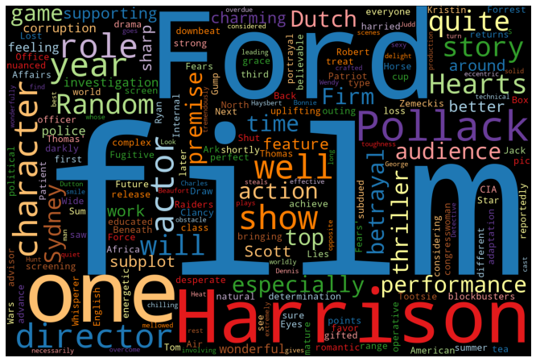
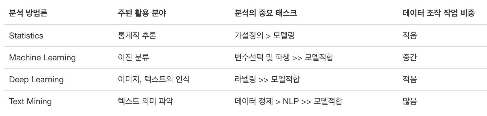

```{r child = "setup.Rmd"}
```

```{r packages, echo=FALSE, message=FALSE, warning=FALSE}
library(dplyr)
library(readr)
library(hlireport)
library(ggplot2)
library(emo)
```

## Executive Summary


.pull-left-wide[
**Q - GIS 분석 모델의 가능성은 무엇인가요?**  
- EDA와 분석 모델을 통해서 **9개의 테마에서 여러 변수가 지점의 수익에 유의한 영향**을 끼친다는 사실 확인.
- 특정 연령, 특정 상품이 수익과 밀접하다는 사실을 통해, **GIS 정보가 '보험 마케팅 전략' 수립 영역에서도 활용 가능**하다는 사실 확인.

**Q - GIS 분석 모델의 활용 방안은 무엇인가요?**  
- GIS 기반의 다양한 데이터를 활용한다면, **고도화된 최적 입지선정 모델**의 개발 가능성 확인
- 모델이 정교하된다면, **지점장의 KPI 척도나 목표치 달성 플랜** 등 지점의 운영 방향과 성장 가능성에 대한 정보 제공 가능

]

---

class: middle

# 텍스트 분석이란 무엇일까?

---

class: middle

# .hand[We...]

.huge[.green[have]] .hand[카페/블로그/뉴스에서 수집한 텍스트 데이터]

.huge[.pink[want]] .hand[우아한 머신러닝, 팬시한 결과, 감탄할 인사이트]

---

## 대중적인 텍스트 분석의 자화상!!! 

.pull-left[
```{r echo=FALSE, out.width="50%"}

```
- **SNS에서 수집된 데이터**
- 개인정보보호 강화로 쪼그라드는 데이터
- 그래도 너가 있어서 다행이다.
]
.pull-right[
```{r echo=FALSE, out.width="50%"}

```
- 데이터 시각화, 그 이름은 **WordCloud**
- 빈도분석 중심의 개괄적인 이해
- 음, 그렇구나. 그래서 어쩌라구요?
]

---

## 분석이라 쓰고 노가다라 읽습니다!!!

.small[
```{r eval=FALSE, echo=FALSE}
library(dplyr)

method <- c("Statistics", "Machine Learning", "Deep Learning", "Text Mining")
app <- c("통계적 추론", "이진 분류", "이미지, 텍스트의 인식", "텍스트 의미 파악")
task <- c(
  "가설정의 > 모델링", 
  "변수선택 및 파생 >> 모델적합", 
  "라벨링 >> 모델적합", 
  "데이터 정제 > NLP >> 모델적합"
)
postion <- c("적음", "중간", "적음", "많음")

data.frame(method, app, task, postion) %>% 
  rename("분석 방법론" = method) %>% 
  rename("주된 활용 분야" = app) %>% 
  rename("분석의 중요 태스크" = task) %>% 
  rename("데이터 조작 작업 비중" = postion) %>%   
  kableExtra::kbl(booktabs = TRUE) %>% 
  kableExtra::kable_styling()
```
]

.tip[
하루 종일 **텍스트를 탐색하며, 정제하고 분석의 실마리를 위한 패턴을 찾고**...<br>
오늘도 그리고 내일도 또...<br>
분석의 수율을 높이기 위해서 대충할 수 없는, 아 **텍스트 전처리 작업**. 
]

```{r echo=FALSE, out.width="95%"}

```

---

## 그래도 훌륭한 정보를 얻을 수 있습니다!!!

.tip[
텍스트분석은 분석 방법과 투입 리소스 대비 **수율이 높은 분석은 아닙**니다.<br>
그래도, 없는 것보다 있는 것이 낫다고요?<br>
아닙니다. **유용한 인사이트를 도출한 사례**도 제법 있습니다. 
]


.small[
<br>

```{r eval=TRUE, echo=FALSE}
library(dplyr)

method <- c(
  "문서 분류(Document Texonomy)", 
  "문서 분류(Document Classification)",   
  "주제 발견(Topic discovery)",
  "감정 분석(Sentiment analysis)", 
  "문서 요약(Document summarization)"
)
algorh <- c(
  "Patthern & Rule", 
  "Machine Laerning",
  "LDA topic analysis", 
  "감성사전, Machine Laerning",
  "Text Rank"
)
app <- c("상담 콜 분류", "상담 콜 민원 예측", "상담 콜 분류", 
         "긍부정 상담 콜 분석", "QA를 위한 상담콜 요약")


data.frame(method, algorh, app) %>% 
  rename("분석 주제" = method) %>% 
  rename("주된 분석 방법" = algorh) %>% 
  rename("활용 사례" = app) %>% 
  kableExtra::kbl(booktabs = TRUE) %>% 
  kableExtra::kable_styling()
```
]


---

class: middle

# 텍스트 분석이란 이런 것이다!

---

class: middle

# .hand[We...]

.huge[.green[have]] .hand[텍스트 데이터와 관련 정형데이터]

.huge[.pink[want]] .hand[텍스트에 내포된 화자의 의도 패턴을 활용 목적에 맞게 이해]

---

class: middle

# 데이터 시각화

---

## Anscombe의 네개 데이터 시각화

```{r quartet-plot, echo = FALSE, out.width = "80%", fig.asp = 0.5}
anscombe %>% 
  select(x1:x4) %>% 
  tidyr::pivot_longer(everything(), names_to = "cases", values_to = "x") %>% 
  mutate(cases = stringr::str_remove(cases, "[a-z]")) %>% 
  bind_cols(
    anscombe %>% 
      select(y1:y4) %>% 
      tidyr::pivot_longer(everything(), names_to = "cases", values_to = "y") %>% 
      select(y)
  ) %>% 
  ggplot(aes(x = x, y = y)) +
  geom_point() +
  facet_wrap(~ cases, ncol = 4)
```

---

## 첫 키스 연령

.question[ 
몇살 때 첫 키스를 했습니까?
]

```{r echo = FALSE, warning = FALSE}
load("data/student_survey.rda")

ggplot(student_survey, aes(x = first_kiss)) +
  geom_histogram(binwidth = 1) +
  labs(
    title = "몇살 때 첫 키스를 했습니까?", 
    x = "Age (years)", y = NULL
    )
```

---

## 페이스북 방문

.question[ 
페이스북 방문 회수의 하한과 상한은 어떻게 표현할까요?
]

```{r echo = FALSE, warning = FALSE}
ggplot(student_survey, aes(x = fb_visits_per_day)) +
  geom_histogram(binwidth = 1) +
  labs(
    title = "하루에 페이스북을 몇 번이나 방문나요?", 
    x = "Number of times", y = NULL
    )
```

---

class: middle

# 데이터 조작 문법

---

## 데이터 조작 문법이란...

... 데이터프레임을 조작하는 **동사로서의 기능 개념**에 기반함

.pull-left[
```{r dplyr-part-of-tidyverse, echo=FALSE, out.width="70%", caption = "dplyr는 tidyverse의 일부입니다"}
knitr::include_graphics("img/dplyr-part-of-tidyverse.png")
```
]
.pull-right[
.midi[
- `select`: 이름과 인덱스로 컬럼을 선택
- `arrange`: 행의 순서를 바꿈, Sort
- `slice`: 인덱스를 사용해서 행을 선택
- `filter`: 조건과 일치하는 행 선택
- `distinct`: 고유한 행을 추출
- `mutate`: 새로운 변수를 파생
- `summarise`: 변수를 집계해서 값을 추출
- `group_by`: 그룹화된 집계를 위해 사용
- ... (그밖에 더)
]
]

---

## **dplyr** 함수의 규칙

- 첫번째 인수는 **항상** 데이터 프레임
- 후속 인수는 해당 데이터 프레임으로 수행할 작업을 설명
- 항상 데이터프레임(tibble)을 반환

---

## Data: 호텔 예약

- 두 호텔의 데이터: 하나의 리조트와 하나의 도시 호텔
- 관측치: 각 행은 호텔 예약을 나타냅니다.
- 원본 데이터 수집 목표: 호텔 예약 취소 가능성 분류 예측 모델 개발 ([Antonia et al., 2019](https://www.sciencedirect.com/science/article/pii/S2352340918315191#bib5))

```{r message=FALSE}
hotels <- read_csv("data/hotels.csv")
```

.footnote[
Source: [TidyTuesday](https://github.com/rfordatascience/tidytuesday/blob/master/data/2020/2020-02-11/readme.md)
]

---

## First look: 변수

```{r output.lines=18}
names(hotels)
```

---

## Second look: 개요

```{r output.lines=18}
glimpse(hotels)
```

---

## 단일 열 선택

`lead_time`만 보기(예약과 도착 날짜 사이의 일수):

```{r}
select(hotels, lead_time)
```

---

## 단일 열 선택

.pull-left[
```{r eval=FALSE}
select( #<<
  hotels, 
  lead_time
  )
```
]
.pull-right[
- 함수(동사)로 시작: `select()`
]

---

## 단일 열 선택

.pull-left[
```{r eval=FALSE}
select( 
  hotels, #<<
  lead_time
  )
```
]
.pull-right[
- 함수(동사)로 시작: `select()`
- First argument: data frame we're working with , `hotels`
]

---

## 단일 열 선택

.pull-left[
```{r eval=FALSE}
select( 
  hotels, 
  lead_time #<<
  )
```
]
.pull-right[
- 함수(동사)로 시작: `select()`
- 첫 번째 인수: 작업 중인 데이터 프레임, `hotels`
- 두 번째 인수: 선택하려는 변수, `lead_time`
]

---

## 단일 열 선택

.pull-left[
```{r}
select( 
  hotels, 
  lead_time
  )
```
]
.pull-right[
- 함수(동사)로 시작: `select()`
- 첫 번째 인수: 작업 중인 데이터 프레임, `hotels`
- 두 번째 인수: 선택하려는 변수, `lead_time`
- 결과: `r nrow(hotels)` 행과 1개의 열이 있는 데이터 프레임
]

---

.tip[
dplyr 함수는 항상 데이터 프레임을 기대하고 항상 데이터 프레임을 생성합니다.
]

```{r}
select(hotels, lead_time)
```

---

## 여러 열 선택


`hotel` 종류와 `lead_time`만 보기:

--

.pull-left[
```{r}
select(hotels, hotel, lead_time)
```
]
--
.pull-right[
.question[
이러한 열을 선택한 다음 리드 타임(lead_time)의 내림차순으로 데이터를 정렬하려면 어떻게 해야 합니까?
]
]

---

## 데이터 조작, step-by-step

.pull-left[
변수 선택:
```{r}
hotels %>%
  select(hotel, lead_time)
```
]

--
.pull-right[
변수 선택 후 정렬:
```{r}
hotels %>%
  select(hotel, lead_time) %>%
  arrange(desc(lead_time))
```
]

---

class: middle

# 파이프(Pipes)

---

## 파이프(pipe)란 무엇인가요?

프로그래밍에서 파이프는 한 프로세스에서 다른 프로세스로 정보를 전달하는 기술입니다.

--

.pull-left[
- 데이터 프레임 `hotels`로 시작하여, 그 값을 `select()` 함수에 전달합니다.
]
.pull-right[
.small[
```{r}
hotels %>% #<<
  select(hotel, lead_time) %>%
  arrange(desc(lead_time))
```
]
]

---

## 파이프(pipe)란 무엇인가요?

프로그래밍에서 파이프는 한 프로세스에서 다른 프로세스로 정보를 전달하는 기술입니다.

.pull-left[
- 데이터 프레임 `hotels`로 시작하여, 그 값을 `select()` 함수에 전달합니다.
- 그런 다음, `hotel`과 `lead_time` 변수를 선택합니다.
]
.pull-right[
.small[
```{r}
hotels %>%
  select(hotel, lead_time) %>% #<<
  arrange(desc(lead_time))
```
]
]

---

## What is a pipe?

프로그래밍에서 파이프는 한 프로세스에서 다른 프로세스로 정보를 전달하는 기술입니다.

.pull-left[
- 데이터 프레임 `hotels`로 시작하여, 그 값을 `select()` 함수에 전달합니다.
- 그런 다음, `hotel`과 `lead_time` 변수를 선택합니다.
- 그런 다음 `lead_time`을 기준으로 데이터 프레임을 내림차순으로 정렬합니다.
]
.pull-right[
.small[
```{r}
hotels %>%
  select(hotel, lead_time) %>% 
  arrange(desc(lead_time)) #<<
```
]
]

---

## Aside

파이프 연산자는 **magrittr** 패키지에서 구현되지만 **tidyverse**가 우리를 위해 이 패키지를 로드하기 때문에 명시적으로 이 패키지를 로드할 필요는 없습니다.

--

.question[
패키지 이름이 magrittr인 이유에 대한 추측이 있습니까?
]

--

.pull-left[
```{r magritte, echo=FALSE, out.width="90%", caption = "Magritte's pipe"}
knitr::include_graphics("img/magritte.jpg")
```
]
.pull-right[
```{r magrittr, echo=FALSE, out.width="100%", caption = "magrittr's pipe"}
knitr::include_graphics("img/magrittr.jpg")
```
]

---

## 파이프는 어떻게 작동합니까?

- 차키 찾기, 자동차 잠금 해제, 자동차 시동, 출퇴근길 운전, 주차와 같은 일련의 작업에 대해 생각할 수 있습니다.

--
- R 수도 코드에서 중첩 함수 집합으로 표현하면 다음과 같습니다.:
```{r eval=FALSE}
park(drive(start_car(find("keys")), to = "work"))
```

--
- 파이프를 사용하여 작성하면 더 자연스럽고 읽기 쉽습니다.
structure:
```{r eval=FALSE}
find("keys") %>%
  start_car() %>%
  drive(to = "work") %>%
  park()
```

---

## 파이핑 및 레이어링에 대한 참고 사항

- **dplyr**의 파이프라인에서 주로 사용되는 `%>%`, *우리는 이전 코드 라인의 출력을 다음 코드 라인의 첫 번째 입력으로 파이프합니다*

--
- **ggplot2** 플롯의 "레이어링"에 사용되는 `+`, *`+`로 구분된 레이어로 플롯을 생성합니다.*

---

## dplyr

.midi[
`r emo::ji("x")`

```{r error=TRUE}
hotels +
  select(hotel, lead_time)
```

`r emo::ji("white_check_mark")`

```{r eval=FALSE}
hotels %>%
  select(hotel, lead_time)
```

```{r echo=FALSE, output.lines=6}
hotels %>%
  select(hotel, lead_time)
```
]

---

## ggplot2

.midi[
`r emo::ji("x")`

```{r error=TRUE}
ggplot(hotels, aes(x = hotel, fill = deposit_type)) %>%
  geom_bar()
```

`r emo::ji("white_check_mark")`

```{r out.width="25%"}
ggplot(hotels, aes(x = hotel, fill = deposit_type)) +
  geom_bar()
```
]

---

## 코딩 스타일

많은 스타일링 원칙이 `%>%` 및 `+`에서 일관되게 사용됩니다:

- 항상 앞에 공백
- 항상 다음에 줄 바꿈(2줄 이상의 파이프라인의 경우)

`r emo::ji("x")`

```{r eval=FALSE}
ggplot(hotels,aes(x=hotel,y=deposit_type))+geom_bar()
```

`r emo::ji("white_check_mark")`

```{r eval=FALSE}
ggplot(hotels, aes(x = hotel, y = deposit_type)) + 
  geom_bar()
```

---

class: middle

# Q & A


